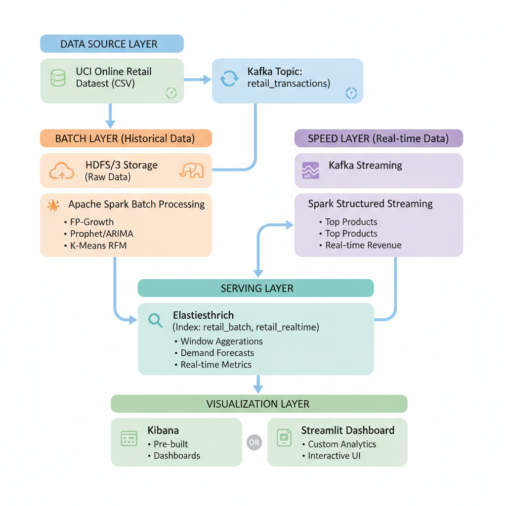

#  Retail Analytics Big Data System

##  Team

This project is developed by a team of 3 members:

- Vũ Minh Sơn - 23020424
- Nguyễn Bá Quang - 23020412
- Trần Doãn Thắng - 23020438

A complete Lambda Architecture implementation for retail data analytics using Apache Spark, Kafka, Elasticsearch, and Streamlit.

##  Overview

This project implements a comprehensive retail analytics system that processes transactional data using both batch and real-time processing to provide:

-  Real-time revenue and sales metrics
-  30-day demand forecasting
-  Market basket analysis (association rules)
-  Inventory optimization
-  Customer segmentation

##  Architecture

<p align = "center">

</p>
<p align = "center">
  System Architecture
</p>

The system follows a Lambda Architecture pattern with three layers:

1. **Batch Layer**: Processes historical data for ML models and analytics
2. **Speed Layer**: Handles real-time streaming data for immediate insights
3. **Serving Layer**: Provides unified access to both batch and real-time results

### Data Flow

```
┌─────────────┐
│ Data Source │ UCI Online Retail Dataset
└──────┬──────┘
       │
       ├──────────────┬─────────────────┐
       │              │                 │
   ┌───▼────┐    ┌────▼─────┐    ┌─────▼────┐
   │ Kafka  │    │ HDFS/S3  │    │  Batch   │
   │Stream  │    │  Storage │    │Processing│
   └───┬────┘    └────┬─────┘    └─────┬────┘
       │              │                 │
   ┌───▼─────┐   ┌───▼──────┐    ┌─────▼─────┐
   │ Spark   │   │  Spark   │    │    ES     │
   │Streaming│   │  Batch   │    │  Serving  │
   └───┬─────┘   └────┬─────┘    └─────┬─────┘
       │              │                 │
       └──────────────┴─────────────────┤
                                        │
                            ┌───────────▼──────────┐
                            │     API Service      │
                            │  (Flask Gateway)     │
                            └───────────┬──────────┘
                                        │
                            ┌───────────▼──────────┐
                            │ Streamlit Dashboard  │
                            └─────────────────────┘
```

##  Quick Start

### Prerequisites

- Docker & Docker Compose
- Python 3.8+
- 8GB+ RAM
- 20GB+ disk space

### Installation

1. **Clone repository**
   ```bash
   git clone https://github.com/your-repo/Supply-Chain-and-Logistics-Optimization.git
   cd Supply-Chain-and-Logistics-Optimization
   ```

2. **Run setup script**
   ```bash
   chmod +x scripts/setup_environment.sh
   ./scripts/setup_environment.sh
   ```

3. **Download dataset**
   ```bash
   chmod +x scripts/download_data.sh
   ./scripts/download_data.sh
   ```
   
   Or use the provided `Online Retail.xlsx` file and convert it to CSV format.

4. **Initialize Elasticsearch**
   ```bash
   python scripts/init_elasticsearch.py
   ```

### Running the System

1. **Start all services**
   ```bash
   make start
   ```
   
   This will:
   - Start all Docker containers (Kafka, Elasticsearch, Spark, etc.)
   - Wait for services to be ready
   - Initialize Elasticsearch indices

2. **Verify services are running** (Optional)
   ```bash
   ./scripts/check_services.sh
   ```
   
   Or check manually:
   ```bash
   docker-compose ps
   ```

3. **Run batch processing jobs**
   ```bash
   make batch
   ```
   
   This runs all batch processing jobs:
   - Data preprocessing
   - Association rules mining
   - Demand forecasting
   - Customer segmentation

4. **Start streaming processing**
   ```bash
   make stream
   ```
   
   This will:
   - Start Kafka producer (data simulator)
   - Start Spark streaming processor

5. **Start API Service** (The dashboard communicates via this API layer)
   ```bash
   # Open a new terminal
   python src/serving_layer/api_service.py
   ```

6. **Launch dashboard**
   ```bash
   # Open a new terminal
   make dashboard
   ```
   
   This starts the Streamlit dashboard interface

### Other Useful Commands

- **Stop all services**
  ```bash
  make stop
  ```

- **Restart all services**
  ```bash
  make restart
  ```

- **View logs**
  ```bash
  make logs
  ```

- **Run tests**
  ```bash
  make test
  ```

- **Clean up (remove containers and data)**
  ```bash
  make clean
  ```

- **Show all available commands**
  ```bash
  make help
  ```

##  Dashboard

Access the dashboard at: `http://localhost:8501`

### Features

1. **Real-time Overview** (`Realtime_Overview.py`)
   - Live revenue metrics
   - Top selling products
   - Country-wise distribution
   - Transaction volume trends

2. **Demand Forecasting** (`Demand_Forecasting.py`)
   - 30-day predictions per product
   - Confidence intervals
   - Historical vs predicted comparison
   - Export capabilities

3. **Market Basket Analysis** (`Market_Basket.py`)
   - Association rules mining
   - Product recommendations
   - Network visualization
   - Support and confidence metrics

4. **Inventory Optimization** (`Inventory_Optimization.py`)
   - Safety stock calculations
   - Real-time alerts
   - Reorder point recommendations
   - Stock level monitoring

##  Technology Stack

- **Data Ingestion:** Apache Kafka, Zookeeper
- **Stream Processing:** Spark Structured Streaming
- **Batch Processing:** Apache Spark (PySpark)
- **Machine Learning:** Spark MLlib, Prophet
- **Storage:** Elasticsearch, Local File System
- **Serving Layer:** Flask (REST API)
- **Visualization:** Streamlit, Plotly
- **Orchestration:** Docker Compose
- **Monitoring:** Kibana

##  Project Structure

```
SUPPLY-CHAIN-AND-LOGISTICS-OPTIMIZATION/
│
├── README.md
├── LICENSE
├── contributing.md
├── Makefile
├── requirements.txt
├── docker-compose.yml
├── Online Retail.xlsx
├── architechture.png
├── model_testing_finally.ipynb
│
├── config/
│   ├── config.yaml
│   ├── spark-defaults.conf
│   ├── elasticsearch.yml
│   └── kafka-config.properties
│
├── data/
│   ├── raw/
│   │   └── online_retail.csv
│   ├── processed/
│   └── checkpoints/
│
├── scripts/
│   ├── setup_environment.sh
│   ├── download_data.sh
│   ├── init_elasticsearch.py
│   ├── run_batch_jobs.sh
│   ├── check_services.sh
│   └── monitor_streaming.sh
│
├── spark_docker/
│   └── Dockerfile
│
├── src/
│   ├── __init__.py
│   │
│   ├── ingestion/
│   │   ├── __init__.py
│   │   ├── data_simulator.py
│   │   └── kafka_producer.py
│   │
│   ├── batch_layer/
│   │   ├── __init__.py
│   │   ├── data_preprocessing.py
│   │   ├── association_rules.py
│   │   ├── demand_forecasting.py
│   │   ├── customer_segmentation.py
│   │   └── batch_job_runner.py
│   │
│   ├── speed_layer/
│   │   ├── __init__.py
│   │   ├── streaming_processor.py
│   │   ├── realtime_metrics.py
│   │   └── inventory_alerts.py
│   │
│   ├── serving_layer/
│   │   ├── __init__.py
│   │   ├── elasticsearch_client.py
│   │   └── api_service.py
│   │
│   └── utils/
│       ├── __init__.py
│       ├── config_loader.py
│       ├── logger.py
│       └── data_validator.py
│
├── dashboard/
│   ├── app.py
│   │
│   ├── pages/
│   │   ├── Realtime_Overview.py
│   │   ├── Demand_Forecasting.py
│   │   ├── Market_Basket.py
│   │   └── Inventory_Optimization.py
│   │
│   ├── components/
│   │   ├── __init__.py
│   │   ├── charts.py
│   │   └── metrics.py
│   │
│   └── assets/
│       └── style.css
│
└── tests/
    ├── __init__.py
    ├── test_batch_processing.py
    ├── test_streaming.py
    └── test_api.py
```

##  Testing

Run all tests:
```bash
python -m pytest tests/
```

Run specific test:
```bash
python tests/test_batch_processing.py
python tests/test_streaming.py
python tests/test_api.py
```

##  Performance

- **Batch Processing:** ~1M records in 30 minutes
- **Stream Processing:** ~10K records/second
- **Dashboard Latency:** <2 seconds
- **ES Query Time:** <100ms

##  Configuration

Edit `config/config.yaml` to customize:

- Spark resources (memory, cores, partitions)
- Kafka topics and consumer groups
- Elasticsearch indices and settings
- Algorithm parameters (support, confidence, forecasting periods)
- Alert thresholds (stock levels, demand spikes)

### Key Configuration Files

- `config/config.yaml` - Main application configuration
- `config/spark-defaults.conf` - Spark cluster settings
- `config/elasticsearch.yml` - Elasticsearch configuration
- `config/kafka-config.properties` - Kafka producer/consumer settings

##  Troubleshooting

### Services not starting

Check Docker logs:
```bash
docker-compose logs -f [service-name]
```

Restart services:
```bash
docker-compose restart
```

### Elasticsearch connection issues

Check ES health:
```bash
curl http://localhost:9200/_cluster/health
```

Access Kibana:
```bash
open http://localhost:5601
```

### Spark job failures

Check Spark UI:
```bash
open http://localhost:8080
```

View executor logs:
```bash
docker exec spark-master ls /opt/spark/work/
```

### Kafka connection issues

Check Kafka topics:
```bash
docker exec -it kafka kafka-topics --list --bootstrap-server localhost:9092
```

Monitor streaming:
```bash
chmod +x scripts/monitor_streaming.sh
./scripts/monitor_streaming.sh
```

##  Documentation

- Architecture diagram: `architechture.png`
- Model testing notebook: `model_testing_finally.ipynb`


### Development Workflow

1. Fork the repository
2. Create a feature branch (`git checkout -b feature/amazing-feature`)
3. Commit your changes (`git commit -m 'Add amazing feature'`)
4. Push to branch (`git push origin feature/amazing-feature`)
5. Open a Pull Request

##  License

MIT License - see [LICENSE](LICENSE) file for details.


##  Acknowledgments

- UCI Machine Learning Repository for the Online Retail Dataset
- Apache Spark community for excellent documentation and support
- Streamlit team for the amazing dashboard framework
- Elasticsearch and Kafka communities


##  Useful Links

- **Spark UI:** http://localhost:8080
- **Kibana:** http://localhost:5601
- **Grafana:** http://localhost:3000
- **Elasticsearch:** http://localhost:9200
- **Streamlit Dashboard:** http://localhost:8501

---

**Note:** Make sure all Docker containers are running before accessing the services. Use `docker-compose ps` to check the status of all services.
